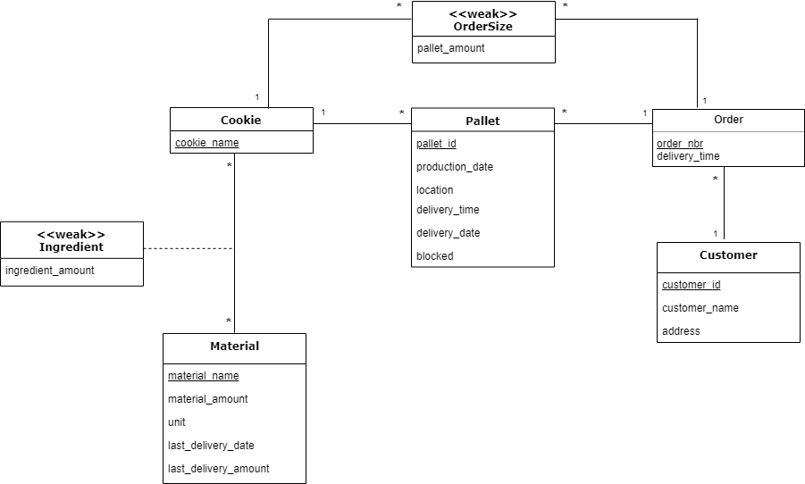

# EDAF75, project report

This is the report for

 + David Jungermann, `dic15dju`
 + Alfred Hirschfeld, `al0015hi-s`
 + David Blomberg, `da3684bl-s`

We solved this project on our own, except for:

 + The Peer-review meeting

## ER-design

The model is in the file [`krusty_uml.png`](krusty_uml.png):

<center>
    
</center>

## Relations

The ER-model above gives the following relations:

+ cookies(**cookie_name**)
+ pallets(**pallet_id**, **_cookie_name_**, **_order_nbr_**, production_date, location, delivery_time, delivery_date, blocked)
+ orders(**order_nbr**, **_customer_id_**, delivery_time)
+ order_sizes(**_cookie_name_**, **_order_nbr_**, pallet_amount)
+ customers(**customer_id**, customer_name, address)
+ material(**material_name**, material_amount, unit, last_delivery_date, last_delivery_amount)
ingredients(**_cookie_name_**, **_material_id_**, ingredient_amount)

## Scripts to set up database

The scripts used to set up and populate the database are in:

 + [`create-schema.sql`](create-schema.sql) (defines the tables), and
 + [`initial.sql`](initial.sql) (inserts data).

So, to create and initialize the database, we run:

```shell
sqlite3 krusty.sqlite < create-schema.sql
sqlite3 krusty.sqlite < initial.sql
```

## How to compile and run the program

To run the REST-server:

```shell
.\gradlew run
```

To test the REST-server: 

```shell
python check-krusty.py
```
